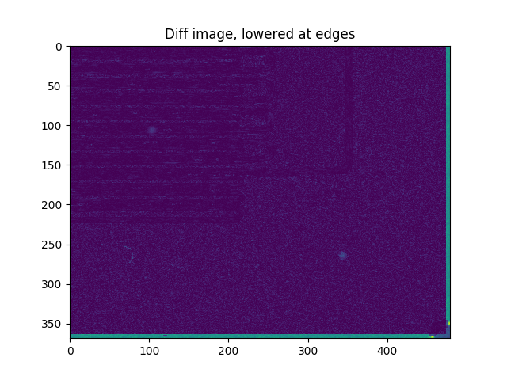
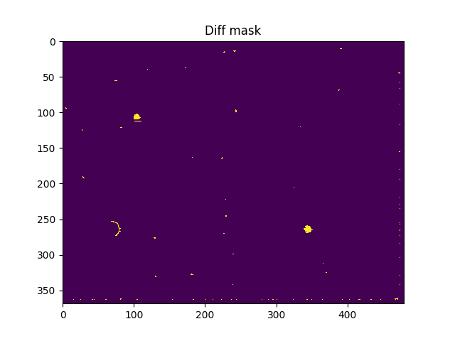

## Summary
In order to find defects, we need to align the reference image and the inspection image to a sub-pixel level 
and compare the two images by absolute difference. Alignment is not perfect, so we want to reduce comparison 
effects on image edges. Lastly, we need to binarize the difference image in a robust way and clean noise.

## Solution Steps
1. Registration
    1. Find sub-pixel translation using cross correlation on upsampled images.
    2. Transform the reference image to the inspection image. 
2. Diff
    1. Calculate the absolute difference between the inspected image and the registered reference image.
3. Lower diff responses where both images have edges
    1. Find Canny edges in both images.
    2. Dilate edge both masks.
    3. Perform a pixel-wise logical and between the to edge masks.
    4. Give the diff image a factor penalty in edge-pixels.
4. Binarize diff image
    1. Perform a 2D hysteresis thresholding.
    2. (Turn off pixels in locations that are invalid due to the translation.)
5. Clean output mask
    1. Perform a morphological close.
    2. Remove small connected components.

## Assumptions
1. The transformation between reference and inspection images is translation only (alignment).
2. Defects have an area of at least 40 pixels.

## Results
First image - two false positives

Second image

Third image

### Additional Results
Step-by-step results for the second image. More results are in the `output` directory.

